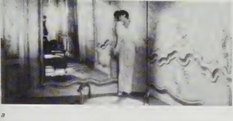
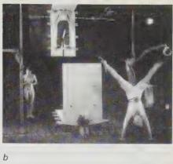

*Figure 1.7a*
\textbf{A still from Alain Renais' *Last Year in Marienbad* (1961), which reproduces Baroque mirror-space.}

*Figure 1.7b*
\textbf{Diller+Scofidio's *Delay in Glass or The Rotary Notary and his Hot Plate* (1987) (a staging of Duchamp's *Large Glass*).
**Two projects in which architecture positions the subject by making him/her into a picture.**

but - an inventory of architectural 'blanks', like panels, windows, screens, paintings and mirrors, and any architectural elements that invoke the picture plane.

 It should be clear that there is no psychoanalytic architecture, only strategies for thinking about architecture and its various discourses. To my mind, it is a disservice to the relation of architecture to criticism to attempt to build too quickly into an architecture the strategies of critique. It usually leads to rather wordy buildings. We should expect the impact of critique upon design to take more circuitous routes.$^18$ It is
possible that different architectures - like different people - are more or less amenable to psychoanalytic critique. Although he does not discuss the styles, Lacan seems to have had a predilection for the Baroque; the convoluted planning and mirrored walls
of the *french hôtel* point the way.$^19$ For him the psyche is an arabesqued and reflective thing. The prime candidates will always be architectures that tarry with their own image, like the classicism of Brunelleschi (his naves) and the modernism of Le Corbusier (but not necessarily architectures based on surrealist techniques like the automatic drawings of Coop Himmelbau or Frank Gehry). The staged sets of Diller+Scofidio are an interesting special case. Le Corbusier photographed his purist villa interiors in ways that problematise the relation of inside to outside. In the image of the Ozenfant studio, the outside is represented as if it were montaged onto the glass. The outside is an imaginary projection of the inside, an idea that harks back to Alberti's metaphor. In the photograph of the Villa Church living room, the outside is represented in a succession of relations to the inside, that recall Lacan's three registers. The far wall transforms from floor-to-ceiling glass to mirror. In between is a hyperbolically framed window. The outside is first in an unmediated relation to the inside (real), then in a relation highly mediated by
architecture and painting (symbolic), and finally a reflection (an imaginary projection of the inside). In this case, imaginary and real are similar, a similarity reflected in Lacan's early thought. In Diller+Scofidio's staging of Duchamp's *Large Glass*, and in Baroque

Introduction

17

