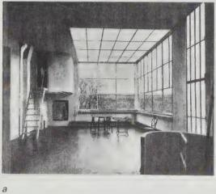
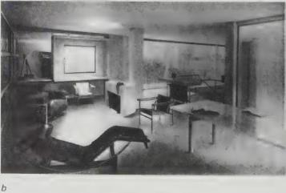

mirror space, the architecture positions the subject by representing it as caught in a picture. These projects problematise their status as space by identifying themselves with representations of space. Architecture is by default an intervention in the field of vision, but these make a particular point of it. In these projects, montage is an effect of camera position, which find lines of alignment between inside and outside, or an effect of mirrors, which are image-producing machines, and which insert the figure into the space as if it were a picture.

This introduction has made many claims; we need now to unpack them. We have mentioned Brunelleschi's demonstration without fully describing it because our purpose here has been to put it in relation to Lacan's diagram. This relation has been described as a displacement of the picture plane, a convergence (*condensation? .. versus displacement*) of thought, a species of montage. It was facilitated by a split. The important point to come away with is that with questions of inside/outside, we are dealing with projection. Perspective is first of all projection. Lacan's diagram is a diagram of projection, at least when read with Brunelleschi's demonstration (Lacan rarely uses the term *projection*). If it is possible to understand the diagrams in these rather abstract terms, it remains to make sense of them in the more accommodating terms of spatial experience, and in the more rigorous terms of a close reading of Brunelleschi's demonstration and Lacan's visual field. We need to put Brunelleschi and Le Corbusier in dialogue, by contemplating images of their spaces. In the first chapter, we return to the two *New Yorker* cartoons: we will begin by examining the image as a projection of the identity of New Yorkers. We will see that every time an image of the world goes out, a message comes back. Projection and its double, introjection. This couple – this operational montage – defines the subject's relation to its world.

*Figure 1.8a*
**Le Corbusier's Ozenfant studio.**

*Figure 1.8b*
**Le Corbusier's Villa Church at Ville d'Avray, living room. Two projects which problematise the architectural relation between interior/exterior, where the outside becomes an imaginary projection of the inside.**

Introduction

18

