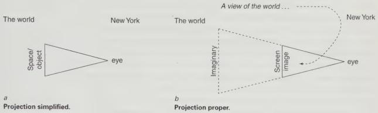

Figure 1.1a and b

of the triangle becomes transparent (Figure 1.1b). What is looked at through the image is indicated by the base of an extended triangle in dashed lines. The diagram reflects the fact that for the subject, every view of the world is also an image. The triangle formalises a relation between two things, someone who identifies with Manhattan and the world, in the terms mobilised by the visual representation of space. The triangle indicates the way the view projects out at the world from a point of projection. The subject stands before this view as before the image, yoked to its centre, the projection point. Position, screen and the triangulated relation between them constitutes a conceptual apparatus, which organises perception and makes it intelligible. In order for projection to work, two things have to happen: New Yorkers have to, in a sense, internalise this apparatus – they have to take it up and make it constitutive of their relation to the world; and they have to identify with this point. New Yorkers easily identify with this point, placing themselves at it, what Lacan calls symbolic identification, and by so doing, make it their world. The fact that we are unaware of these symbolic burdens does not mean they do not operate, simply that they are unconscious.

Every perspective is someone’s view, and the fact that someone else can move into the same position to have the same view makes it no more objective than the fact that two people who repeat the same words make meaning objective. For the subject, the perspective is not an objective view but a universal form of subjectivity. It is the form of view which says that every view is subjective. It is not a view from all positions or from no position (whatever that might be). It is not clear what other forms of view there might be that would have a stronger claim on objectivity, a view that would constitute a standard against which any particular views – a New Yorker’s, a Chinese’s – could be measured. Such a view would be a truth against which subjectivity (image, opinion, prejudice, taste, fiction) is measured.$^{3}$

 It is no use protesting that *view* of the world is ambiguous between *image and perspective*: the image could be anything – a cartoon for instance – and a perspective is a precise survey of space; the image is subjective and perspective is objective. The joke is mobilised because this image takes the form of a perspective, and for the subject perspective has the status of an image. This cover inhabits two registers: it is not just a view (i.e. a perspective) of the world from New York, but an image that reflects the

The New Yorkers

23

