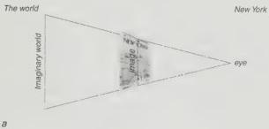
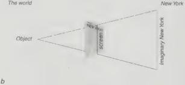

self-importance of New Yorkers. The smaller bits at the top are both farther away (perspective) and less important (image). The fact that the view in *A View of the World...* is a projection of the subject (its attitudes, prejudices, etc.) led to the conclusion that this cover functions as an image. But all perspectives are projections too. Every perspective is an image for the subject and every image is projected upon the world. If *A View of the World...* is 'distorted', it is because it is inconsistent with perspective, not because it is inconsistent with the world. Medieval painting is inconsistent with Renaissance perspective painting, not inconsistent with the world. Perspective deviates from other forms like plan or axonometric. That all perspectives are projections was one of Lacan's points, perhaps also Holbein's, when he asks us to view within the same space the immaculately foreshortened lute and an anamorphic skull in *The Ambassadors.*^4

In the first instance, the diagrams reflect the implied *trompe l'œil* or transparency of representation. We look through the *image* to the *thing* imaged. We see the world through the image of the view. If Figure 1.1a simply placed the viewer in front of an image or an object, Figure 1.1b shows that visual experience goes through the image. The diagram should be familiar to any student of perspective or to anyone who has ever run a slide projector. It is borrowed from perspective, but the image need not be a view (it could be the plan of *New Yorkistan*; *A View of the World...* isn't exactly a perspective either). Perspective is but the form of the relation of subject to the world. Visual space, the kind of space where things seem to get smaller (opaque) when they get farther away (transparent), is a constant reminder of -- but not the same as -- another relation, which is the relation of image, any image, even a perspective image, to subject and world.

 The image here seems transparent. When we look at the *New Yorker* cover, we either see a picture of an aerial view printed on a magazine cover, opaque; or we see an aerial view of the world, transparent. These options are indicated by Figures 1.1a and b respectively, and they always go together. But when we see Manhattan in an aggrandised relation to the rest of the world, the image functions as a screen. It becomes

 *A View of the World...* is my view of you. *New Yorkistan* is not my view of me, but your view of me, in so far as you succeed in communicating it back to me. And because it is yours, it is strange to me.

Figure 1.2a

A view of *A View of the World...* or *A View of the World...* as projection.

Figure 1.2b

A view of *New Yorkistan* or *New Yorkistan* as projection.

Projection and introjection

24

