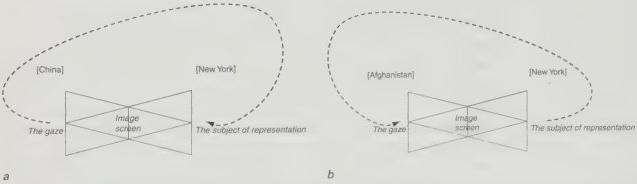

Figure 1.3a and b

A provisional mapping of *A View of the World...* and *New Yorkistan* onto Lacan's diagram of the visual field. To someone who identifies with Manhattan, the Chinese view themselves as New Yorkers view them and New Yorkers view themselves the way they view Afghanistans. The dashed line represents the circuit that goes through the field of the other. The identity of people who identify with Manhattan is not encapsulated in a simple image (of, for ex-ample, Manhattan), but is a relationship between images of New York and the world.

*World...*). It is presented for their point of view but not *from*) it. New Yorkers see Manhattan but only from the space they attribute to others or in a form they attribute to others. These two *New Yorker* covers make of Manhattan a rather odd proposition. Manhattan is either a point located outside the view, from which an image of others is projected; or else it is a dream for others.

New Yorkers' fear of places populated by strange tribes is really a fear of themselves. New Yorkers are not afraid of these tribes and their devastated land, because they are too far away (even 9/11 did not penetrate this fantasy). The joke is that what New Yorkers are afraid of is themselves. For all their bullishness about Manhattan, New Yorkers are afraid of the city at night, the darkened stoops and lobbies of its serried ranks of apartment buildings. They are masters of crossing to the safer side of the street. *Streetwise* for which New Yorkers are famous is not a savvy attitude towards the city; it's just a savvy name for fear. Although New York (Manhattan at least) is a uniform grid, and with the exception of a few parks like Morningside, the grid covers the island uniformly, New York is as ghettoised as any European city upon whose crooked and hierarchical streets a social history is inscribed. This means that the plan of Manhattan is hierarchical. You cannot read from the grid where the neighbourhoods change, and so cannot read from the plan where you are safe and where not. On the Upper West Side (Trumpistan), for instance, the difference between danger and safety can depend upon which side of Broadway you are on.

 Manhattan is a murky battle ground of congressional and city council districts, postal codes and phone exchanges, neighbourhood school boards, ethnic, social and political groups, old industries and new services, special interest groups, graffiti artists, income brackets, street gangs, turf, muggers and salesmen, street vendors, galleries, fruit stands and public art projects, all in conflict with each other, and all out to get you (*all those Jamaican, Dominican, Puerto Rican Sunday soccer leagues, decked out in red and green and yellow, oh... and Harlem starts at 110th, right?*). New Yorkistan is the hidden

Projection and Introjection

26

