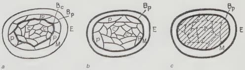

Manhattan that lies under the plan, that deceptively *untransparent* grid. It is the plan
that makes Manhattan safe for cruising again (it shows you where Badassin begins). As
comforting as it might be to have this plan to hand when venturing out of an evening, it
has to be suppressed for it reveals the prejudice and fear that lies beneath the surface of
the liberal middle-class artsy academicy intelligentsia to whom *The New Yorker* speaks
directly. In more ways than one, the alienation that this cover provokes is an alienation
from within.

# Introjection

This cartoon is funny because it turns out that the fear New Yorkers have of other places conceals an unacknowledged anxiety New Yorkers have about themselves. According to Freud, we project the bad object and introject the good one. If projection involves the subject expelling something from within and casting it upon the world, introjection involves the subject internalising features of the world into itself. The bad object returns to haunt us in the form of strange names, we experience it as anxiety, and we do our best to shield ourselves from it with jokes.$^{7}$

Although both processes involve crossing a psychic frontier between the
subject's inner and outer worlds, it would be a mistake to think that introjection is simply
the reverse sense of projection. For Lacan, contra Freud, introjection is of an entirely
different order. Projection involves the image and the imaginary order (reverse projection
is simply projection of an image by others). Introjection involves the internalisation of
an object and relates to language and the symbolic order. It is therefore bound up with
the discourse on objects that abounds in Lacan's text, which revolves around his *arché-*
object *objet* $\alpha$, and takes in the theory of desire and the drives.

 We carve out the proper space of introjection with words and other signifiers.
*New Yorkistan* is a plan, not a view, and in this plan, language takes pride of place.
That the alienation provoked by this plan is an effect of language should be clear from

Figure 1.4a, b and c

'Relations between various strata of the person under different circumstances', from Kurt Levin (1936). Examples of topological diagrams of Levin's psychological life space, which recall the interconnected blobular namescape of *New Yorkistan*. According to Levin, psychological life space is divided into regions with different degrees of separation from each other. Figures a, b and c indicate the same psyche under different degrees of stress.

The New Yorkers

27

