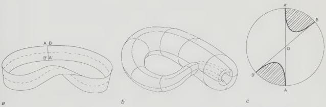

if not projective, and through it, Lacan argues, the subject articulates its outer from inner world for the first time. It will remain a template for identity and for the world. In *The Four Fundamental Concepts of Psychoanalysis*, Lacan articulates the subject's visual field with a diagram that combines projection and reverse projection in one structure. The viewing subject views itself. The viewing subject is viewed by others. Although Lacan does not discuss introjection in the context of the visual field, introjection and reverse projection are linked, because the image that returns to the subject returns on the speech of the other. The cartoon has to be unpacked by interpretation (this text, my voice) in order for its effect to be known; the view of an other is not a possible part of the subject's visual field unless it is communicated back to the subject by words, pictures or other media.$^{18}$

If we read the cartoons together.... The strange language of *New Yorkistan* is projected into the familiar space of *A View of the World...*; *A View of the World...* is projected onto the map of the world that is *New Yorkistan*. They form the double triangle. We can speculate about an economy between architecture and language, how the view of architecture and the plan of language infect each other’s spaces. In *A View of the World...*, the world is presented as a familiar view which envelops the subject like Adolf Loos’ well-tailored suit. In *New Yorkistan*, Manhattan is a surface tattooed in strange names over which the subject can perhaps glide, but hardly inhabit. The one reaffirms, the other alienates. Writing and speech carry with them the unbearable closeness of one subject to another, and space is the screen that both projects them and screens them out. According to Georg Simmel, sociologist of nineteenth-century cities, we build public spaces to ameliorate the effects of social interaction in the congested metropolis. According to Vitruvius, architecture is both the site for and an effect of the newly known language. (It is equally the site for a reversal of this assimilation, when at a stroke, at Babel, language became strange again.)$^{19}$

 When it is projected, language is wallpaper. Introjected speech has the form of a linguistic bullet. We are assailed everywhere by the armour-piercing speech

Figure 1.5a,b and c

Mobius strip, Klein bottle and diagram showing that the projective plane returns like a mobius strip when it is projected to infinity. (Diagrams redrawn from Aleksandrov *et al., Mathematics* (1963)).

The New Yorkers

31

